# Self Study Studio 产品功能说明图

最近核对：2026-07-12

这套图只描述当前 App 已实现的产品闭环。每张图都保留 Mermaid 源文件，并提供 SVG 与 PNG；修改 `.mmd` 后运行 `scripts/render-product-diagrams.sh` 重新生成静态图片。

## 1. 学习轨迹核心闭环

Quick Log 与 Timer 最终都会生成同一种 Session。Proof 让学习结果可被回看，Weekly Review 则把 Session 和 Proof 转化为下一步决定；项目状态与 Next Step 只有在用户明确确认后才会改变。

## 2. 当前信息架构

当前主导航由 Today、Projects、Library 三个 Tab 组成。Review 按条件从 Today 或项目历史进入，AI Review Settings 位于工具栏，不是常驻 Tab。

## 3. 标准 Demo 故事板

推荐用 5–10 分钟讲完一条完整故事：从 Today 的 Next Step 开始，经由 Timer、Session 和 Proof 形成 Trail，最后在 Weekly Review 中做出继续、降频或暂停的决定。

## 4. 首次使用与首条记录

Onboarding 一次创建 1–3 个项目。用户必须完成第一条 Quick Log Session，App 才认为首次设置完成并进入 Today。

## 5. 日常 Session 记录

Quick Log 服务于 30 秒补记，Timer 服务于现场学习。暂停不会计入活动时长，舍弃不会保存；两条路径都会在保存时更新 Project、Trail 和可选的新 Next Step。

## 6. Proof 学习证据

Proof 支持图片、录音、文件和链接。附件本身不足以成为 Proof，用户必须补充“这证明了什么”，说明学到了什么或暴露了什么问题。

## 7. Weekly Review

Review 输出 Facts、Patterns、Decisions 和 Next Steps，并显示来源。生成结果可以编辑；保存 Review 不等于接受建议，状态与 Next Step 分别通过显式按钮应用。

## 8. AI Review 降级

配置完整时，App 调用 OpenAI-compatible Chat Completions。没有配置、请求失败或 JSON 解析失败时，App 使用本地规则复盘，用户仍然可以得到并编辑 Review。

## 9. 数据导出

用户可以导出版本化的 `journal.json`、按 Project/Session/Proof 整理的附件，或者包含两者的完整 Export Bundle。失败不会修改或删除原始数据。

## 尚未进入当前产品流程

以下能力已有设计与实施计划，但尚未进入当前 App，因此没有画进上述现行流程：

- CloudKit/iCloud 私有同步
- AI 课程规划
- 学习日历与 EventKit

它们只有在产品代码完成并通过验证后，才应加入现行功能图。

## 维护规则

任何改变导航、用户可见行为、数据流、失败降级或 Demo 路径的提交，都应同时：

1. 修改对应的 `product-*.mmd`。
2. 运行 `scripts/render-product-diagrams.sh`。
3. 检查 SVG 与 PNG 是否完整、清晰且与当前界面一致。
4. 更新本页图注及“尚未进入当前产品流程”。
