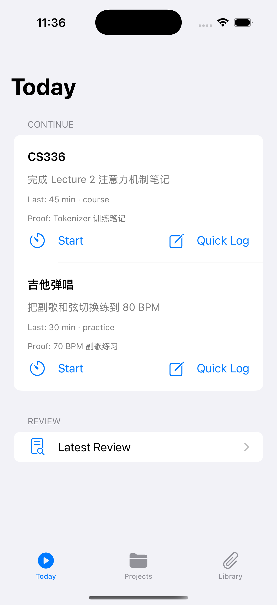
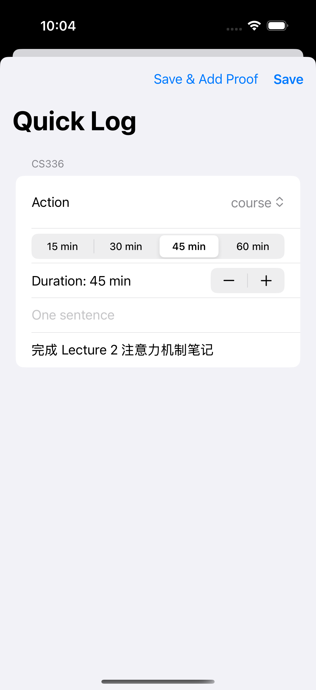
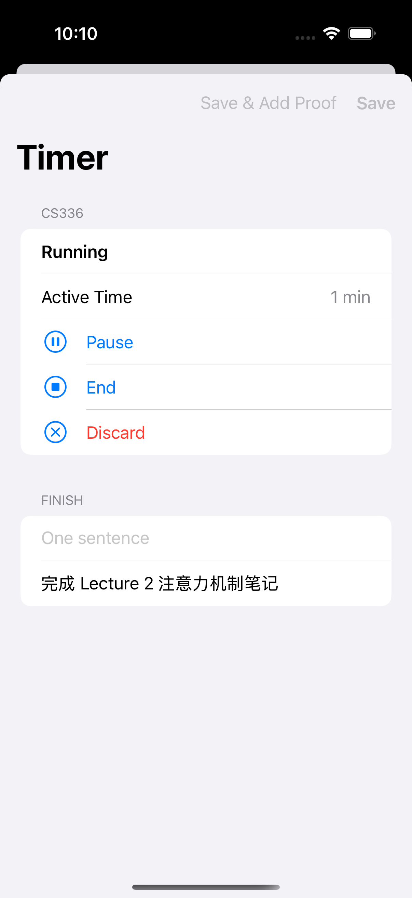
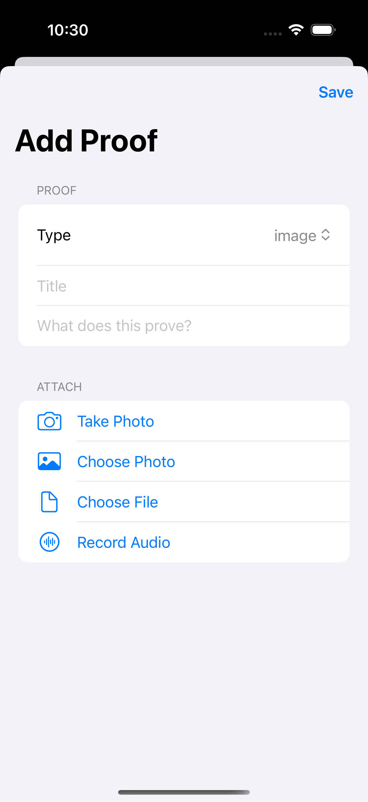
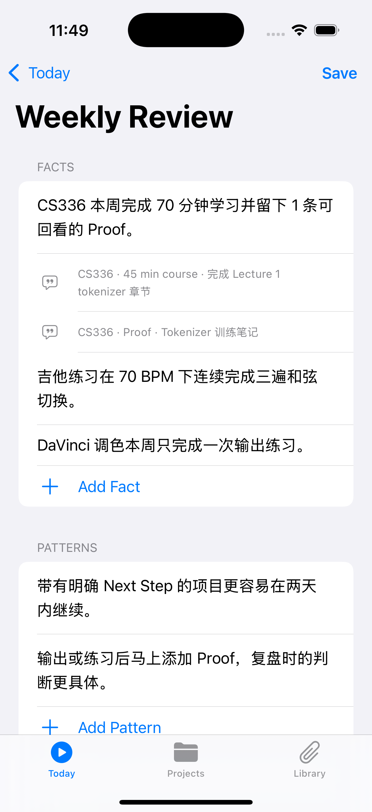
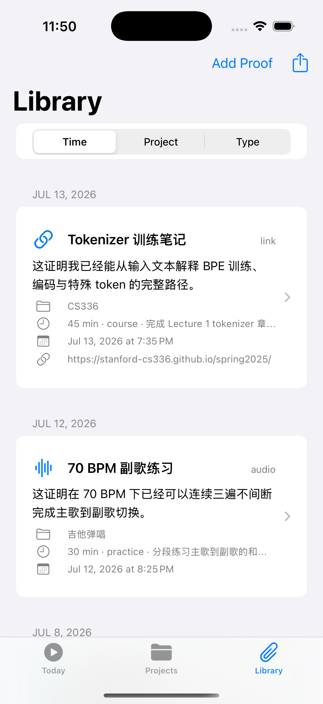

# Self Study Studio 产品功能手册

文档版本：1.0  
最近核对：2026-07-13  
对应分支：`codex/product-function-diagrams`  
产品阶段：v0.1 学习闭环  
验证基线：50 个测试执行，49 个通过，1 个既知断言失败

> Self Study Studio 是一个本地优先的个人学习日志。它用 Project、Session、Proof、Trail 和 Review，把“我学了什么”转化为“下一步做什么”。

## 1. 产品概览

### 1.1 一句话定位

一个帮助个人学习者把行动、证据和复盘串成下一步决定的本地优先学习日志。

### 1.2 目标用户

适合同时推进多个自学项目，但不想花大量时间维护知识管理系统的人。典型项目可以是计算机课程、乐器练习、影像创作或任何需要持续行动与阶段判断的学习目标。

### 1.3 用户问题

普通笔记很容易留下大量零散内容，却很难持续回答三个问题：

1. 这周真正做了什么？
2. 哪些结果能证明学习发生了？
3. 下一次打开项目时应该做什么？

### 1.4 核心价值

- Today 把可以直接执行的 Next Step 放在最前面。
- Quick Log 和 Timer 用低摩擦方式生成统一的 Session。
- Proof 要求解释“这证明了什么”，避免附件堆积。
- Trail 把行动、证据、状态变化与复盘串成项目历史。
- Review 从近期证据中形成 Facts、Patterns、Decisions 和 Next Steps。
- AI 是可选边界；没有网络或配置时，本地规则仍能完成复盘。
- 数据默认保存在本地，并可完整导出。

### 1.5 产品边界

当前版本不是课程平台、社交社区、排行榜、连续打卡工具或全自动学习 Agent。CloudKit/iCloud、AI 课程规划和学习日历已有设计，但尚未进入现行产品流程。

## 2. 学习轨迹核心闭环

使用从一个具体 Next Step 开始。Quick Log 适合补记，Timer 适合现场学习；两者最终都会生成同一种 Session。Proof 给行动留下可回看的证据，Review 再结合 Session 与 Proof 做出继续、降频、暂停或调整 Next Step 的决定。

## 3. 产品原则与核心概念

### 3.1 产品原则

- 手机优先：入口少、操作短、随时能记录。
- 继续学习优先：先让用户行动，再要求整理。
- Proof 优先于完成百分比：保存能支持判断的证据。
- 日常记录与阶段判断分离：Session 负责事实，Review 负责决定。
- AI 不进入日常记录主流程：AI 不可用时不阻断核心闭环。
- 本地优先：数据由用户掌控，并提供完整导出。

### 3.2 六个核心概念

- **Project（学习项目）**：一个持续目标及其当前状态。
- **Next Step（下一步）**：下一次可以直接执行的具体动作。
- **Session（学习记录）**：一次已经发生的学习行动。
- **Proof（学习证据）**：图片、录音、文件或链接，以及它所证明的内容。
- **Trail（学习轨迹）**：一个 Project 的 Session、Proof、Next Step、状态和 Review 时间线。
- **Review（复盘）**：把近期证据整理为事实、模式、决定和下一步。

## 4. 当前信息架构

完成首次设置后，App 只有三个主入口：

- **Today**：继续学习、快速记录、计时与进入 Review。
- **Projects**：创建、编辑、改变状态，并查看项目详情与 Trail。
- **Library**：按时间、Project 或类型浏览 Proof，并导出数据。

Review 与 AI Review Settings 只在 Today 或需要复盘的 Project Detail 中出现，不是独立 Tab。Calendar、Course Plan 和 Cloud Sync 不属于当前导航。

## 5. 功能模块关系

SwiftUI 页面通过统一状态协调层调用学习规则、附件、Review 和导出能力。Journal Store 正常使用 SwiftData，初始化失败时降级到 JSON Store；旧版 `journal.json` 可在新存储为空时一次性导入。附件保存在本地目录，AI Endpoint/Model 保存在偏好设置，API Key 进入 Keychain。Export 使用内存 Snapshot 生成完整 Bundle，不直接读取数据库。

## 6. 详细功能说明

### 6.1 首次启动与 Project 创建

**用户目的**：用最少信息建立 1–3 个当前学习项目。  
**入口**：首次启动且 Onboarding 尚未完成。  
**前置条件**：无。  
**主流程**：填写 Project 名称、可选 Area、Goal 和 Next Step；可以继续添加第二、第三个项目；确认后进入首条记录步骤。  
**系统规则**：名称、Goal 和 Next Step 必填；全部项目以原子操作创建，任何一项无效时不保存半成品。  
**完成门槛**：至少为首个项目保存一条 Quick Log Session 后，App 才进入 Today。

### 6.2 Today Continue

**用户目的**：打开 App 后立刻知道可以继续什么。  
**入口**：Today Tab。  
**展示规则**：只显示状态为 `active` 且 Next Step 非空的 Project。卡片包含项目名、Next Step、最近 Session 和最近 Proof 上下文。  
**操作**：Start 打开 Timer；Quick Log 打开快速记录。  
**空状态**：没有可继续项目时显示 “No Active Next Step”，提示为 active Project 添加 Next Step。

### 6.3 Project 管理

**用户目的**：管理目标、Next Step 和项目节奏。  
**入口**：Projects Tab；右上角 Add Project。  
**字段**：Project、Area、Goal、Next Step。  
**状态**：`active`、`low-frequency`、`paused`、`archived`。  
**详情页**：集中提供 Start、Quick Log、Add Proof、状态、Sessions、Proofs、Reviews 与 Learning Trail。  
**规则**：状态与 Next Step 变化会形成 Trail 事件；归档项目不会出现在 Today Continue。

### 6.4 Quick Log

**用户目的**：在约 30 秒内补记一次已经发生的学习。  
**入口**：Today、Project Detail 或首次设置。  
**关键字段**：Project 默认值、Action Type、预设/自定义时长、学习内容、新 Next Step。  
**保存结果**：生成 Session，刷新 Project 最近行动类型与时间；Next Step 有变化时同步更新 Project 并写入 Trail。  
**失败状态**：备注为空或时长无效时不保存。

### 6.5 Timer Session

**用户目的**：记录正在发生的学习，并只统计真正投入的时间。  
**入口**：Today 或 Project Detail 的 Start。  
**操作**：Pause、Resume、End、Discard。  
**系统规则**：暂停时段不计入活动时长；Discard 不生成 Session；End 后填写学习内容和可选的新 Next Step。  
**关系**：保存后的数据模型与 Quick Log 相同，后续可以继续添加 Proof。

### 6.6 Proof 创建

**用户目的**：保留能支持阶段判断的学习证据。  
**入口**：Project、Session、Quick Log、Timer 或 Library。  
**类型**：图片、录音、文件、链接。  
**关键字段**：标题、附件或 URL、“What does this prove?”。  
**系统规则**：证据说明必填；附件可以关联具体 Session，也可以仅关联 Project。  
**失败与权限**：摄像头、照片、麦克风与文件选择受系统权限影响；链接 Proof 可作为无权限时的演示备用路径。

### 6.7 Proof Detail

**用户目的**：回看证据内容、证明说明及其来源。  
**显示内容**：Project、关联 Session、创建时间、类型、标题和 statement。  
**预览方式**：图片预览、本地音频播放、Quick Look 文件预览、外部链接打开。  
**失败状态**：本地附件缺失时显示不可用状态，不伪造预览。

### 6.8 Learning Trail

**用户目的**：按时间回看项目真实发生过的变化。  
**入口**：Project Detail 的 Learning Trail 区域。  
**事件类型**：Session、Proof、Review、状态变化、Next Step 变化。  
**产品含义**：Trail 不是完成百分比，而是一条可以支持继续或调整项目的证据历史。

### 6.9 Review 提醒

**用户目的**：在项目停滞或近期证据充足时进入阶段判断。  
**入口**：Today Review 区域或需要复盘的 Project Detail。  
**触发条件**：active Project 连续 7 天没有行动，或近期证据达到 Review 条件。  
**关联入口**：只有 Review 区域出现时，AI Review Settings 才随之出现。

### 6.10 Weekly Review

**用户目的**：把近期 Session 与 Proof 转化为事实、模式、决定和下一步。  
**输出**：Facts、Patterns、Decisions、Project-specific Next Steps、状态建议、来源摘要与引用。  
**保存规则**：生成结果会保存；用户可以继续编辑并再次 Save。  
**显式应用**：保存 Review 不等于应用建议；Apply Status 与 Use as Next Step 是独立操作。  
**Trail 规则**：只有 Review 含有具体 Project 的 Next Step 或状态建议时，才为该 Project 写入 Review Trail 事件。

### 6.11 AI Review 与本地降级

**配置**：Endpoint、Model 与 API Key。Endpoint/Model 进入偏好设置，API Key 保存在 Keychain。  
**AI 路径**：配置完整时调用 OpenAI-compatible Chat Completions。  
**降级路径**：未配置、请求失败或 JSON 解析失败时，使用本地证据规则生成 Review。  
**用户影响**：降级不阻断 Review，结果仍可编辑、保存和显式应用。

### 6.12 Library 浏览

**用户目的**：从证据角度回看全部学习项目。  
**入口**：Library Tab。  
**分组**：Time、Project、Type。  
**每条信息**：Proof 标题、statement、Project、Session 摘要、时间与附件信息。  
**限制**：v0.1 没有全文搜索。

### 6.13 完整 Bundle 导出

**用户目的**：把结构化记录和附件一起带走。  
**入口**：Library 工具栏 Export。  
**输出**：版本化 `journal.json`，以及按 Project/Session/Proof 整理的附件。  
**路径**：`Documents/LearningJournal/Exports/export-<timestamp>`。  
**反馈**：成功显示 Export Ready 和路径；失败显示 Export Failed。  
**数据安全**：失败不会修改或删除原始数据。

### 6.14 本地存储与旧数据导入

**正常路径**：SwiftData 保存 Projects、Sessions、Proofs、Reviews、Trail events 和 Onboarding 状态。  
**降级路径**：SwiftData 初始化失败时使用 JSON Store。  
**迁移规则**：新存储为空且检测到旧 `journal.json` 时执行一次性导入，旧文件保持不变。  
**边界**：当前没有账号、多设备同步与冲突解决。

### 6.15 AI Review Settings

**入口**：Today 或 Project Detail 的条件性 Review 区域。  
**字段**：Endpoint、Model、API Key。  
**操作**：Save、Clear Saved API Key。  
**校验**：Endpoint 必须是有效 URL；没有配置时界面说明会使用本地 fallback。  
**安全边界**：API Key 不进入常规偏好设置或导出数据。

## 7. 端到端用户流程

### 7.1 第一次使用

创建 1–3 个 Project，选择首个项目并保存第一条 Quick Log Session，随后进入 Today。这个门槛确保首页第一次出现时已经有一条真实学习记录。

### 7.2 日常快速记录

从 Today Continue 选择 Quick Log，填写时长与内容，必要时更新 Next Step；保存后 Project、Session 和 Trail 同步变化。

### 7.3 计时学习与 Proof

从 Start 进入 Timer，结束后保存 Session，再添加带说明的 Proof。Session 说明做了什么，Proof 说明结果证明了什么。

### 7.4 项目停滞与周复盘

当 Review 提醒出现时，App 聚合近期 Session 与 Proof，优先尝试已配置 AI，否则使用本地规则。用户编辑结果后保存，并独立决定是否应用状态或 Next Step 建议。

### 7.5 数据导出

从 Library 点击 Export，一次生成 `journal.json` 与附件目录。App 仅提示本地路径，不自动分享或上传。

## 8. 5–10 分钟标准 Demo

### 8.1 演示目标

让第一次接触产品的人理解：它不追求记录更多，而是用最小记录形成可复盘的学习轨迹，并持续产生下一步决定。

### 8.2 演示数据

- **CS336**：主故事，Next Step 是完成 Lecture 2 注意力机制笔记。
- **吉他弹唱**：展示练习与音频/视频 Proof。
- **DaVinci 调色**：展示输出型 Session 和图片 Proof。

### 8.3 演示步骤

#### 步骤 1：Today 是行动入口

- 操作：打开 Today，定位 CS336 Continue 卡片。
- 讲解：Next Step 直接回答“现在做什么”。
- 预期：看到 Start、Quick Log、最近 Session 和 Proof 上下文。
- 备用：若无卡片，确认 Project 为 active 且 Next Step 非空。

#### 步骤 2：Quick Log 用于快速补记

- 操作：选择 action type、时长，填写内容与新的 Next Step。
- 讲解：补记与 Timer 进入相同 Session 模型。
- 预期：保存后 Session 出现在 Project Detail 和 Trail。
- 备用：备注为空或时长无效时补全后重试。

#### 步骤 3：Timer 只统计活动时间

- 操作：展示 Pause、Resume、End 和 Discard。
- 讲解：暂停不累计时间，舍弃不保存。
- 预期：End 后保存 Session 并可更新 Next Step。
- 备用：演示时间不足时展示界面后改用 Quick Log 完成闭环。

#### 步骤 4：Proof 要解释证据意义

- 操作：从 Session 或 Project 添加链接或图片 Proof。
- 讲解：附件只有配上“这证明了什么”，才成为学习证据。
- 预期：Proof 同时进入 Project、Session、Trail 和 Library。
- 备用：权限不可用时改用链接 Proof。

#### 步骤 5：Trail 展示项目真实历史

- 操作：进入 CS336 Project Detail，滚动到 Learning Trail。
- 讲解：Trail 把行为、证据与决定放回同一条时间线。
- 预期：看到 Session、Proof、Next Step、状态和 Review 事件。
- 备用：事件不足时先完成 Quick Log 和 Proof。

#### 步骤 6：Review 形成决定但不自动改写 Project

- 操作：打开 Latest Review，编辑内容并展示 Apply Status 与 Use as Next Step。
- 讲解：AI 或本地规则只能提出建议，应用权仍在用户。
- 预期：来源可回看，保存与应用操作分离。
- 备用：AI 不可用时使用本地规则 Review。

#### 步骤 7：Library 与完整导出

- 操作：切换 Time、Project、Type，然后点击 Export。
- 讲解：证据可以多角度回看，数据也可以完整带走。
- 预期：显示 Export Ready 与本地路径。
- 备用：失败时解释原始数据不会被修改或删除。

## 9. 功能状态矩阵

| 能力 | 状态 | 用户可见结果 | 验证证据 | 当前限制 |
| --- | --- | --- | --- | --- |
| Onboarding 与首条 Session | 已实现 | 创建 1–3 个 Project 后完成首条记录 | ViewModel/Service tests | Area 可空，其余核心字段必填 |
| Today Continue | 已实现 | active Project 显示 Next Step | TodayView/Service tests | 无 Next Step 不显示 |
| Quick Log 与 Timer | 已实现 | 两种入口生成统一 Session | Service/ViewModel tests | Timer 真机后台行为未验证 |
| Proof 与预览 | 已实现 | 图片、音频、文件、链接证据 | Attachment/Preview tests | 受设备权限和本地文件可用性影响 |
| Trail | 已实现 | 项目时间线串联关键事件 | Service tests | 只在 Project Detail 内 |
| Weekly Review | 已实现 | 可编辑复盘与显式应用建议 | ReviewService/ViewModel tests | AI 不是必需条件 |
| OpenAI-compatible Review | 部分实现 | 配置后调用 Chat Completions | Provider tests | 1 个来源引用断言失败 |
| Library 与完整导出 | 已实现 | Proof 分组浏览并导出 Bundle | Export tests | 只保存本地路径 |
| SwiftData 与旧 JSON 导入 | 已实现 | 本地持久化和一次性迁移 | Store tests | 没有多设备冲突处理 |
| CloudKit/iCloud | 已设计 | 当前无入口 | 设计/实施计划 | 尚未进入产品代码 |
| AI 课程规划 | 已设计 | 当前无入口 | 设计/实施计划 | 尚未进入产品代码 |
| 学习日历 | 已设计 | 当前无 Calendar Tab | 设计/实施计划 | 尚未进入产品代码 |

## 10. 当前限制与已知问题

### 10.1 测试

2026-07-13 执行 50 个测试，49 个通过。失败用例是 `testOpenAICompatibleProviderParsesJSONContentFromChatCompletion`：测试响应缺少 `sourceReferences`，但断言期望 `Create one notebook.` 能映射到 `session abc: Lecture 1`；当前解码在字段缺失时返回空字典。

### 10.2 设备与平台

- 模拟器构建和启动可验证。
- 当前文档不把真机安装描述为已验证。
- 摄像头、照片、麦克风和文件入口需要相应系统权限。

### 10.3 产品范围

- v0.1 是本地优先单设备体验，没有账号与同步。
- 没有搜索、社交、排行榜、课程市场和复杂日历。
- AI Review 是可选边界，不会阻断日常记录和本地复盘。

## 11. 路线图与非目标

### 已设计

- CloudKit/iCloud 私有同步
- AI 课程规划
- 学习日历与 EventKit

### 当前非目标

- 账号与多人协作
- 社交、排行榜和连续打卡压力
- 课程市场
- 完整 Pomodoro 系统
- 全自动学习 Agent
- 桌面或 Web 版本

## 12. 维护说明

任何改变导航、用户可见行为、数据流、失败降级或 Demo 路径的提交，都应完成以下检查：

1. 更新 `docs/PRODUCT_GUIDE.md` 中的产品事实和状态矩阵。
2. 更新 `docs/product-guide/content.json` 中的共享摘要。
3. 修改对应 `diagrams/product-*.mmd` 并重新生成 SVG/PNG。
4. 界面明显变化时重新采集 `docs/assets/product-guide/demo-*.png`。
5. 运行 `scripts/generate-product-guide.sh` 重新生成 PPTX 与 A4 版本。
6. 更新核对日期、Git commit、测试基线和已知限制。
7. 逐页检查所有演示稿和 PDF，无溢出、遮挡、图片拉伸或失真。

## 13. 变更记录

### 2026-07-13 · v1.0

- 建立完整产品功能手册结构。
- 接入 10 张现行产品流程图。
- 明确当前能力、部分实现能力和已设计能力边界。
- 增加 5–10 分钟标准 Demo 脚本与真实截图位置。
- 建立 PPTX、A4 PDF 和 Markdown 同步维护规则。
