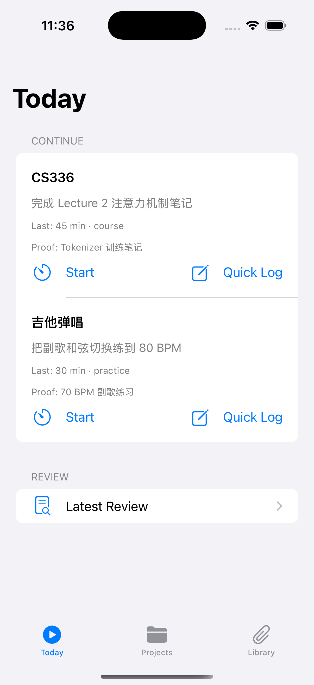
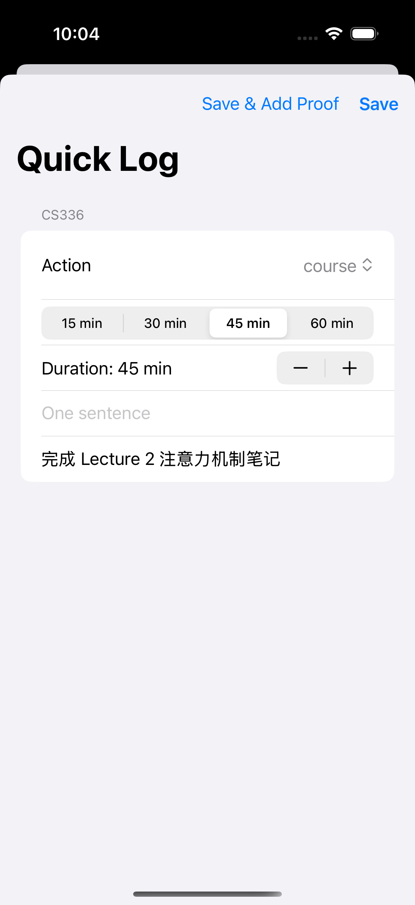
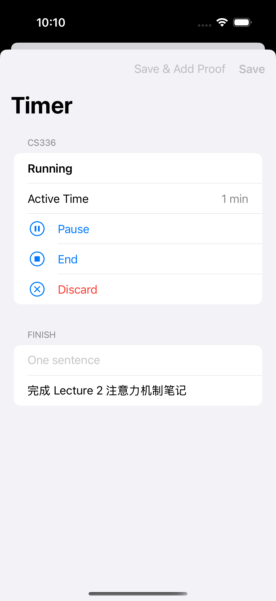
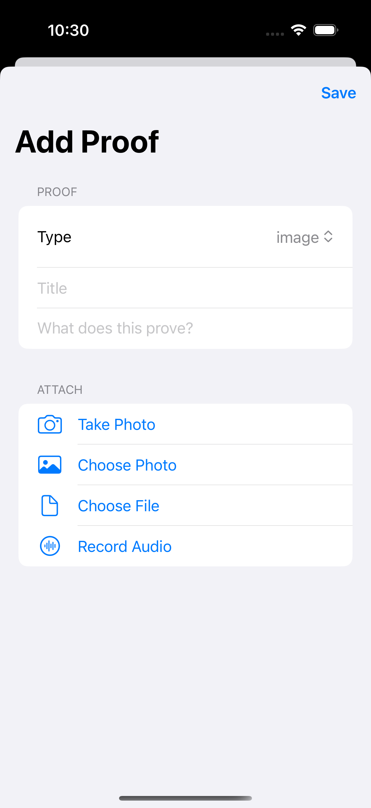
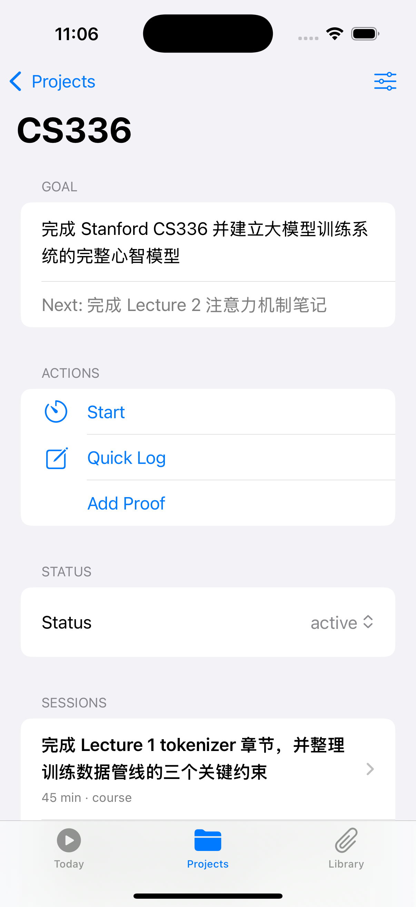
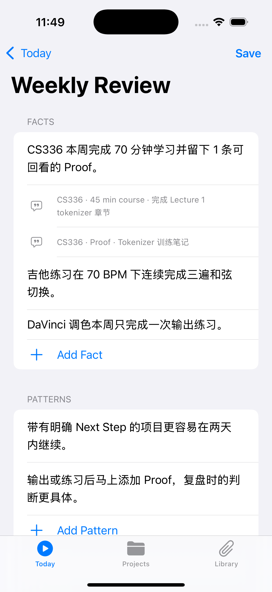
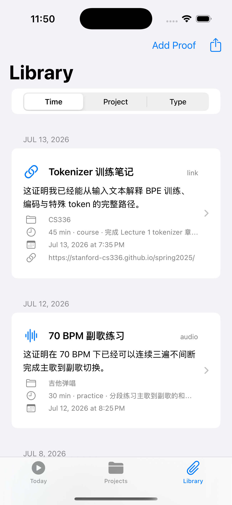

# Self Study Studio 产品功能手册

文档版本：1.3 
最近核对：2026-08-09 
产品阶段：v0.1 证据优先闭环（iPhone + Web C1/C2）；D1 本地验收已覆盖，实时门禁待完成 
验证基线：`swift test` 446 个测试，0 失败；Web `npm test` 63/63（2026-08-09）

> **本手册描述已发布的 iPhone 与 Web 形态。** B1–B6（Project 生命周期、Learning Plan Revision、Practice Blocks、Today Agenda、Planning Window、Stage Review/Qualifying Proof）、单个 PlannedSession
> Reschedule、Plan Revision、Stage Review Readiness、Stage Review 和 Qualifying Proof 已进入当前实现；
> Web Workspace 默认使用明确标记的 Demo fixture；Real journal 已接入 CloudKit 读写、Revision Guard、冲突工作区和可恢复草稿。真实 CloudKit/设备验收仍是发布门槛。
> Today 的日期内排序 override 只保存在当前 ViewModel 内存中，不进入 Journal、CloudKit 或导出。
>
> 配套 PPTX、A4 PPTX、A4 PDF 与 10 张流程图已按本页事实重新生成；真实 CloudKit、真机、EventKit、浏览器视觉/VoiceOver 与双设备收敛仍不能由本地验证替代。

> Self Study Studio 是一个本地优先的个人学习日志。它用 Project、Session、Proof、Trail 和 Review，把“我学了什么”转化为“下一步做什么”。

## 1. 产品概览

### 1.1 一句话定位

一个帮助个人学习者把行动、证据和复盘串成下一步决定的本地优先学习日志。

### 1.2 目标用户

适合同时推进多个自学项目，但不想花大量时间维护知识管理系统的人。典型项目可以是计算机课程、乐器练习、影像创作或任何需要持续行动与阶段判断的学习目标。

### 1.3 用户问题

普通笔记很容易留下大量零散内容，却很难持续回答三个问题：

1. 这周真正做了什么？
2. 哪些结果能证明学习发生了？
3. 下一次打开项目时应该做什么？

### 1.4 核心价值

- Today 把可以直接执行的 Next Step 放在最前面。
- Quick Log 和 Timer 用低摩擦方式生成统一的 Session。
- Proof 要求解释“这证明了什么”，避免附件堆积。
- Trail 把行动、证据、状态变化与复盘串成项目历史。
- Review 从近期证据中形成 Facts、Patterns、Decisions 和 Next Steps。
- AI 是可选边界；没有网络或配置时，本地规则仍能完成复盘。
- 数据默认保存在本地，并可完整导出。

### 1.5 产品边界

当前版本不是课程市场、社交社区、排行榜、连续打卡工具或全自动学习 Agent。CloudKit/iCloud 私有同步、Learning Plan、Stage Review 和学习日历已经进入产品流程；Web Workspace 默认展示明确标记的 Demo，也可在 Real Journal 模式下读取并通过 Revision Guard 写入同一份私有 Journal。

## 2. 学习轨迹核心闭环



使用从一个具体 Next Step 开始。Quick Log 适合补记，Timer 适合现场学习；两者最终都会生成同一种 Session。Proof 给行动留下可回看的证据，Review 再结合 Session 与 Proof 做出继续、降频、暂停或调整 Next Step 的决定。

## 3. 产品原则与核心概念

### 3.1 产品原则

- 手机优先：入口少、操作短、随时能记录。
- 继续学习优先：先让用户行动，再要求整理。
- Proof 优先于完成百分比：保存能支持判断的证据。
- 日常记录与阶段判断分离：Session 负责事实，Review 负责决定。
- AI 不进入日常记录主流程：AI 不可用时不阻断核心闭环。
- 本地优先：数据由用户掌控，并提供完整导出。

### 3.2 六个核心概念

- **Project（学习项目）**：一个持续目标及其当前状态。
- **Next Step（下一步）**：下一次可以直接执行的具体动作。
- **Session（学习记录）**：一次已经发生的学习行动。
- **Proof（学习证据）**：图片、录音、文件或链接，以及它所证明的内容。
- **Trail（学习轨迹）**：一个 Project 的 Session、Proof、Next Step、状态和 Review 时间线。
- **Review（复盘）**：把近期证据整理为事实、模式、决定和下一步。

## 4. 当前信息架构



完成首次设置后，App 有四个主入口（见 `Sources/PersonalLearningJournal/Views/RootView.swift`）：

- **Today**：继续学习、快速记录、计时与进入 Review。
- **Projects**：创建、编辑、改变状态，并查看项目详情与 Trail。
- **Calendar**：日/周/月学习日历、排课草稿与 EventKit 确认。
- **Library**：按时间、Project 或类型浏览 Proof，并导出数据。

Review 与 AI Review Settings 只在 Today 或需要复盘的 Project Detail 中出现，不是独立 Tab。Learning Plan 与 Cloud Sync 也不是独立 Tab：前者从 Project Workspace 进入，后者在设置或 Web Sync & Conflicts 中进入。

上方的信息架构图现在同时标出四个 iPhone Tab、Web Demo/Real 模式、Sync & Conflicts 与 Recoverable Drafts。

## 5. 功能模块关系



SwiftUI 页面通过统一状态协调层调用学习规则、附件、Review 和导出能力。Journal Store 正常使用 SwiftData，初始化失败时降级到 JSON Store；旧版 `journal.json` 可在新存储为空时一次性导入。附件保存在本地目录，AI Endpoint/Model 保存在偏好设置，API Key 进入 Keychain。Export 使用内存 Snapshot 生成完整 Bundle，不直接读取数据库。

## 6. 详细功能说明

### 6.1 首次启动与 Project 创建

**用户目的**：用最少信息建立 1–3 个当前学习项目。 
**入口**：首次启动且 Onboarding 尚未完成。 
**前置条件**：无。 
**主流程**：填写 Project 名称、可选 Area、Goal 和 Next Step；可以继续添加第二、第三个项目；确认后进入首条记录步骤。 
**系统规则**：名称、Goal 和 Next Step 必填；全部项目以原子操作创建，任何一项无效时不保存半成品。 
**完成门槛**：至少为首个项目保存一条 Quick Log Session 后，App 才进入 Today。

### 6.2 Today Continue

**用户目的**：打开 App 后立刻知道可以继续什么。 
**入口**：Today Tab。 
**展示规则**：只显示状态为 `active` 且 Next Step 非空的 Project。卡片包含项目名、Next Step、最近 Session 和最近 Proof 上下文。 
**操作**：Start 打开 Timer；Quick Log 打开快速记录。 
**空状态**：没有可继续项目时显示 “No Active Next Step”，提示为 active Project 添加 Next Step。

#### Today Agenda 与 Carryover

Today 同时展示 active Project 的一个 Next Step、当天或逾期的 PlannedSession，以及符合星期设置的 Practice routine。排序是确定性的；Agenda 的 Up Next、Later Today、Optional 和 Skip Today 是当天的展示 override，不会改写 Journal 源记录，也不会进入 CloudKit 或导出。

逾期 PlannedSession 会显示 Carryover，并保留实际的原始窗口开始/结束时间与 deadline。用户可以选择 Do Today、Skip，或打开独立的 Reschedule sheet 选择新的日期与窗口结束时间；Reschedule 只更新选中的 PlannedSession，并写入一条 scheduleChanged Trail 事件。Revise Plan 仍进入 Plan detail/wizard，创建结构性的新 revision，不是单个 session 的改期。

### 6.3 Project 管理

**用户目的**：管理目标、Next Step 和项目节奏。 
**入口**：Projects Tab；右上角 Add Project。 
**字段**：Project、Area、Goal、Next Step。 
**状态**：`idea`、`active`、`paused`、`completed`、`abandoned`；归档与 Trash 是独立的生命周期动作。 
**详情页**：集中提供 Start、Quick Log、Add Proof、状态、Sessions、Proofs、Reviews 与 Learning Trail。 
**规则**：状态与 Next Step 变化会形成 Trail 事件；Completed/Abandoned 项目可归档，Trash 中的项目可恢复或按保留策略永久删除，不会出现在 Today Continue。

### 6.4 Quick Log

**用户目的**：在约 30 秒内补记一次已经发生的学习。 
**入口**：Today、Project Detail 或首次设置。 
**关键字段**：Project 默认值、Action Type、预设/自定义时长、学习内容、新 Next Step。 
**保存结果**：生成 Session，刷新 Project 最近行动类型与时间；Next Step 有变化时同步更新 Project 并写入 Trail。 
**失败状态**：备注为空或时长无效时不保存。



### 6.5 Timer Session

**用户目的**：记录正在发生的学习，并只统计真正投入的时间。 
**入口**：Today 或 Project Detail 的 Start。 
**操作**：Pause、Resume、End、Discard。 
**系统规则**：暂停时段不计入活动时长；Discard 不生成 Session；End 后填写学习内容和可选的新 Next Step。 
**关系**：保存后的数据模型与 Quick Log 相同，后续可以继续添加 Proof。

### 6.6 Proof 创建

**用户目的**：保留能支持阶段判断的学习证据。 
**入口**：Project、Session、Quick Log、Timer 或 Library。 
**类型**：图片、录音、文件、链接。 
**关键字段**：标题、附件或 URL、“What does this prove?”。 
**系统规则**：证据说明必填；附件可以关联具体 Session，也可以仅关联 Project。 
**失败与权限**：摄像头、照片、麦克风与文件选择受系统权限影响；链接 Proof 可作为无权限时的演示备用路径。



### 6.7 Proof Detail

**用户目的**：回看证据内容、证明说明及其来源。 
**显示内容**：Project、关联 Session、创建时间、类型、标题和 statement。 
**预览方式**：图片预览、本地音频播放、Quick Look 文件预览、外部链接打开。 
**失败状态**：本地附件缺失时显示不可用状态，不伪造预览。

### 6.8 Learning Trail

**用户目的**：按时间回看项目真实发生过的变化。 
**入口**：Project Detail 的 Learning Trail 区域。 
**事件类型**：Session、Proof、Review、状态变化、Next Step 变化。 
**产品含义**：Trail 不是完成百分比，而是一条可以支持继续或调整项目的证据历史。

### 6.9 Review 提醒

**用户目的**：在项目停滞或近期证据充足时进入阶段判断。 
**入口**：Today Review 区域或需要复盘的 Project Detail。 
**触发条件**：active Project 连续 7 天没有行动，或近期证据达到 Review 条件。 
**关联入口**：只有 Review 区域出现时，AI Review Settings 才随之出现。

### 6.10 Weekly Review

**用户目的**：把近期 Session 与 Proof 转化为事实、模式、决定和下一步。 
**输出**：Facts、Patterns、Decisions、Project-specific Next Steps、状态建议、来源摘要与引用。 
**保存规则**：生成结果会保存；用户可以继续编辑并再次 Save。 
**显式应用**：保存 Review 不等于应用建议；Apply Status 与 Use as Next Step 是独立操作。 
**Trail 规则**：只有 Review 含有具体 Project 的 Next Step 或状态建议时，才为该 Project 写入 Review Trail 事件。



#### 阶段复盘与 Qualifying Proof

Project 的 Plan Phase 到期、Planned Sessions 已解决、可检查 Proof 出现，或学习者主动请求时，iPhone
会生成确定性的 Stage Review Readiness。打开 Stage Review 只写入带 Phase/Session/Proof 来源引用的草稿；
它不会自动发布。发布 `advancePhase` 必须选择 Qualifying Proof、填写满足的验收标准，并由活跃 Evidence
Contract、Proof Revision 与 EvidenceAcceptance 一起原子提交。没有 Qualifying Proof 时，只能继续、延长、
修改计划、暂停或放弃；延长/修改计划会创建受 Revision Guard 保护的 Plan Revision Draft，不会覆盖当前计划。

### 6.11 AI Review 与本地降级

**配置**：Endpoint、Model 与 API Key。Endpoint/Model 进入偏好设置，API Key 保存在 Keychain。 
**AI 路径**：配置完整时调用 OpenAI-compatible Chat Completions。 
**降级路径**：未配置、请求失败或 JSON 解析失败时，使用本地证据规则生成 Review。 
**用户影响**：降级不阻断 Review，结果仍可编辑、保存和显式应用。



### 6.12 Library 浏览

**用户目的**：从证据角度回看全部学习项目。 
**入口**：Library Tab。 
**分组**：Time、Project、Type。 
**每条信息**：Proof 标题、statement、Project、Session 摘要、时间与附件信息。 
**限制**：v0.1 没有全文搜索。

### 6.13 完整 Bundle 导出

**用户目的**：把结构化记录和附件一起带走。 
**入口**：Library 工具栏 Export。 
**输出**：版本化 `journal.json`，以及按 Project/Session/Proof 整理的附件。 
**路径**：`Documents/LearningJournal/Exports/export-<timestamp>`。 
**反馈**：成功显示 Export Ready 和路径；失败显示 Export Failed。 
**数据安全**：失败不会修改或删除原始数据。



### 6.14 本地存储与旧数据导入

**正常路径**：SwiftData 保存 Projects、Sessions、Proofs、Reviews、Trail events 和 Onboarding 状态。 
**降级路径**：SwiftData 初始化失败时使用 JSON Store。 
**迁移规则**：新存储为空且检测到旧 `journal.json` 时执行一次性导入，旧文件保持不变。 
**边界**：iPhone 的 canonical store、CloudKit outbox 与 Web Real Journal 仍不等于已完成实时双设备验收；D1 明确区分本地 fake/contract 证据与 live gate。

### 6.15 AI Review Settings

**入口**：Today 或 Project Detail 的条件性 Review 区域。 
**字段**：Endpoint、Model、API Key。 
**操作**：Save、Clear Saved API Key。 
**校验**：Endpoint 必须是有效 URL；没有配置时界面说明会使用本地 fallback。 
**安全边界**：API Key 不进入常规偏好设置或导出数据。

### 6.16 Web Workspace：Demo、Real 与 Sync & Conflicts

**Demo 模式**：使用明确标记的 deterministic fixture，只用于产品走查；Demo record 不属于 canonical Journal，写入适配器会直接拒绝。 
**Real Journal 模式（C1）**：CloudKit JS 读取 Journal Owner 的私有 `LearningJournalZone`，保留 record change tag、合同解码与 provenance；配置、认证、schema 或 zone 失败会显示 blocked/signed-out/partial/error，不回退 Demo。 
**受保护写入（C2）**：Web 只通过 typed writer 执行 Next Step、Learning Plan/Plan Revision、Practice Routine、Qualifying Proof 与 Stage Review 等批准操作；批次使用 `ifServerRecordUnchanged` 和 atomic custom-zone write，base/target Revision Guard 独立捕获。 
**冲突**：不同字段可三方合并；同字段或结构性冲突展示 base/local/remote、时间与 affected records，必须显式 Keep Remote、Discard Local、Rebase 或合法 Fork，绝不自动 LWW。 
**Recoverable Draft**：未完成的计划/例程/Review 草稿只写 IndexedDB（不可用时 localStorage），浏览器重启后可恢复；只有 CloudKit semantic commit 才清除草稿，离线不能变成 canonical record。

### 6.17 D1 交叉表面验收边界

`scripts/d1-release-check.mjs` 映射 12 个 Web Workspace MVP 场景并运行 Swift/Web 本地检查；本地脚本报告不把 Node fake、Simulator、静态 source manifest 或 unit tests 当成实时账户证据。当前真实 CloudKit schema/token/origin、已签名物理设备、EventKit 写入、附件跨设备下载、浏览器视觉/VoiceOver 与人工无 AI/Support Service loop 仍分别为 `BLOCKED` 或 `NOT_RUN`。

## 7. 端到端用户流程

### 7.1 第一次使用



创建 1–3 个 Project，选择首个项目并保存第一条 Quick Log Session，随后进入 Today。这个门槛确保首页第一次出现时已经有一条真实学习记录。

### 7.2 日常快速记录

从 Today Continue 选择 Quick Log，填写时长与内容，必要时更新 Next Step；保存后 Project、Session 和 Trail 同步变化。

### 7.3 计时学习与 Proof

从 Start 进入 Timer，结束后保存 Session，再添加带说明的 Proof。Session 说明做了什么，Proof 说明结果证明了什么。

### 7.4 项目停滞与周复盘

当 Review 提醒出现时，App 聚合近期 Session 与 Proof，优先尝试已配置 AI，否则使用本地规则。用户编辑结果后保存，并独立决定是否应用状态或 Next Step 建议。

### 7.5 数据导出

从 Library 点击 Export，一次生成 `journal.json` 与附件目录。App 仅提示本地路径，不自动分享或上传。

## 8. 5–10 分钟标准 Demo



### 8.1 演示目标

让第一次接触产品的人理解：它不追求记录更多，而是用最小记录形成可复盘的学习轨迹，并持续产生下一步决定。

### 8.2 演示数据

- **CS336**：主故事，Next Step 是完成 Lecture 2 注意力机制笔记。
- **吉他弹唱**：展示练习与音频/视频 Proof。
- **DaVinci 调色**：展示输出型 Session 和图片 Proof。

### 8.3 演示步骤

#### 步骤 1：Today 是行动入口



- 操作：打开 Today，定位 CS336 Continue 卡片。
- 讲解：Next Step 直接回答“现在做什么”。
- 预期：看到 Start、Quick Log、最近 Session 和 Proof 上下文。
- 备用：若无卡片，确认 Project 为 active 且 Next Step 非空。

#### 步骤 2：Quick Log 用于快速补记



- 操作：选择 action type、时长，填写内容与新的 Next Step。
- 讲解：补记与 Timer 进入相同 Session 模型。
- 预期：保存后 Session 出现在 Project Detail 和 Trail。
- 备用：备注为空或时长无效时补全后重试。

#### 步骤 3：Timer 只统计活动时间



- 操作：展示 Pause、Resume、End 和 Discard。
- 讲解：暂停不累计时间，舍弃不保存。
- 预期：End 后保存 Session 并可更新 Next Step。
- 备用：演示时间不足时展示界面后改用 Quick Log 完成闭环。

#### 步骤 4：Proof 要解释证据意义



- 操作：从 Session 或 Project 添加链接或图片 Proof。
- 讲解：附件只有配上“这证明了什么”，才成为学习证据。
- 预期：Proof 同时进入 Project、Session、Trail 和 Library。
- 备用：权限不可用时改用链接 Proof。

#### 步骤 5：Trail 展示项目真实历史



- 操作：进入 CS336 Project Detail，说明 Sessions、Proofs、Reviews 与 Learning Trail 位于同一项目页面。
- 讲解：Trail 把行为、证据与决定放回同一条时间线。
- 预期：看到 Goal、Next Step、Actions、Status 与 Sessions；完整 Trail 结构使用前文流程图说明。
- 备用：事件不足时先完成 Quick Log 和 Proof。

#### 步骤 6：Review 形成决定但不自动改写 Project



- 操作：打开 Latest Review，编辑内容并展示 Apply Status 与 Use as Next Step。
- 讲解：AI 或本地规则只能提出建议，应用权仍在用户。
- 预期：来源可回看，保存与应用操作分离。
- 备用：AI 不可用时使用本地规则 Review。

#### 步骤 7：Library 与完整导出



- 操作：切换 Time、Project、Type，然后点击 Export。
- 讲解：证据可以多角度回看，数据也可以完整带走。
- 预期：显示 Export Ready 与本地路径。
- 备用：失败时解释原始数据不会被修改或删除。

## 9. 功能状态矩阵

| 能力 | 状态 | 用户可见结果 | 验证证据 | 当前限制 |
| --- | --- | --- | --- | --- |
| Onboarding 与首条 Session | 已实现 | 创建 1–3 个 Project 后完成首条记录 | ViewModel/Service tests | Area 可空，其余核心字段必填 |
| Today Continue | 已实现 | active Project 显示 Next Step | TodayView/Service tests | 无 Next Step 不显示 |
| Today Agenda 与 Carryover | 已实现 | PlannedSession、Practice cadence、Project Next Step 与逾期 Carryover | TodayAgendaService/CoursePlanningService tests | 日期内 override 仅在当前 ViewModel 内存中，不同步 |
| 单个 PlannedSession Reschedule | 已实现 | 独立 sheet 选择新日期/窗口结束时间，只改选中 session 并写 scheduleChanged Trail | CoursePlanningService tests | 真机 Dynamic Type 与 CloudKit 并发仍需设备门禁 |
| Learning Plan Revision | 已实现 | Plan detail/wizard 创建结构性 revision；不与单个 session 改期混用 | CoursePlanning/PlanLifecycle tests | 计划结构修改仍需 guarded activation |
| Practice Blocks、Focus 与 Segments | 已实现 | Routine Player 支持有序 Block、跳过、重访、Segments 与崩溃恢复 | PracticeBlocks/PracticeTimerRuntime tests | Web 不承担现场计时；真机与实时同步仍需门禁 |
| Planning Window 与 Capacity Check | 已实现 | 按周/项目汇总计划与练习负载，DST 周仍保持确定性 | PlanningWindowCapacity/CoursePlanning tests | EventKit 权限和实际日历写入仍需门禁 |
| Quick Log 与 Timer | 已实现 | 两种入口生成统一 Session | Service/ViewModel tests | Timer 真机后台行为未验证 |
| Proof 与预览 | 已实现 | 图片、音频、文件、链接证据 | Attachment/Preview tests | 受设备权限和本地文件可用性影响 |
| Trail | 已实现 | 项目时间线串联关键事件 | Service tests | 只在 Project Detail 内 |
| Weekly Review | 已实现 | 可编辑复盘与显式应用建议 | ReviewService/ViewModel tests | AI 不是必需条件 |
| Stage Review Readiness / Stage Review | 已实现 | 按 Phase 提示、打开草稿并显式发布阶段决定 | StageReviewService/StageReviewServiceTests | 真实账户跨端发布与真机仍需门禁 |
| Qualifying Proof | 已实现 | 通过 Evidence Contract、Proof Revision 与验收标准接受 Proof 后推进 Phase | StageReviewService/JournalRecordContract tests | 只在 Stage Review 发布路径生效 |
| OpenAI-compatible Review | 部分实现 | 配置后调用 Chat Completions；失败回到本地规则 | Provider tests | Endpoint/model/key 与网络兼容性仍是外部依赖 |
| Library 与完整导出 | 已实现 | Proof 分组浏览并导出 Bundle | Export tests | 只保存本地路径 |
| SwiftData 与旧 JSON 导入 | 已实现 | 本地持久化和一次性迁移 | Store tests | 没有多设备冲突处理 |
| CloudKit/iCloud | 已实现（需配置） | 私有同步、outbox、冲突与账号空间边界 | CloudSync/SwiftData tests | 真实账户、CloudKit schema、网络和双设备仍需设备门禁 |
| Web C1 Demo/Real Journal | 部分实现 | Demo fixture 明确不可写；Real 读取私有 Journal 且不回退 Demo | journal-reader-projector/cloudkit-contract tests | token/schema/origin/同账号浏览器验证仍待完成 |
| Web C2 guarded writes | 部分实现 | typed atomic writer 支持 Plan、Routine、Qualifying Proof、Stage Review 与 Next Step | journal-write tests | 生产 CloudKit conditional write 与双端发布仍待完成 |
| Sync Conflicts 与 Recoverable Drafts | 部分实现 | 展示 base/local/remote，禁止隐藏 LWW；草稿可跨浏览器重启恢复 | sync-conflicts/recoverable-drafts tests | 浏览器视觉/辅助技术与跨设备 Audit/Trail 仍未运行 |
| AI Learning Plan | 已实现（可选） | 配置后生成 draft；本地校验与手动流程可独立运行 | Provider/CoursePlanning tests | Endpoint/model/key 与网络是外部依赖 |
| 学习日历 | 已实现（需权限） | 日/周/月排课草稿与 EventKit 二次确认 | Calendar tests | 真机权限、可写日历和外部事件仍需设备验证 |
| D1 本地自动化验收 | 部分实现 | 12 个场景映射到 Swift/Web 本地证据，并单列 BLOCKED/NOT_RUN live gates | scripts/d1-release-check.mjs | 真实账户、物理设备、EventKit、视觉/VoiceOver 仍未完成 |

## 10. 当前限制与已知问题

### 10.1 测试

2026-08-09 执行 `swift test` 共 446 个测试，0 失败，并通过 `swift build`；Web `npm test` 63/63，`npm run lint` 和 production build 通过。D1 脚本把 12 个场景映射到本地 Swift/Web 证据。静态测试/build 不等同于 Dynamic Type、VoiceOver、物理设备、实时 CloudKit 或双设备收敛验收。

### 10.2 设备与平台

- 模拟器构建和启动可验证。
- 真机门禁依赖 Developer Team、iCloud 容器、CloudKit schema、Push 权限和签名安装，模拟器通过不构成真机验证。
- 摄像头、照片、麦克风和文件入口需要相应系统权限。

### 10.3 产品范围

- 单人私有 iCloud 同步已实现；没有账号体系与多人协作。
- 没有搜索、社交、排行榜和课程市场。
- AI Review 与 AI 辅助 Learning Plan 都是可选边界，不会阻断日常记录、本地规划和本地复盘。
- Web Workspace 默认跑明确标记的 Demo；Real Journal 已接入真实 Journal 的读取与受保护写入，token/schema/origin/同账号设备验收尚未完成。

## 11. 路线图与非目标

### 已实现（v0.1 之后陆续加入）

- CloudKit/iCloud 私有同步
- AI 辅助 Learning Plan 与本地降级
- 学习日历与 EventKit 双重确认

### 已实现但仍有外部验收门槛

见 [跨端迁移路线图](cross-surface-migration-roadmap.md)：B1–B6 iPhone 能力、C1 Real/Demo Web 读取、C2 guarded writes/conflicts/drafts，以及 D1 本地自动化映射均已进入当前代码。真实 CloudKit、物理设备、EventKit、浏览器视觉/VoiceOver 与双设备收敛仍需单独 gate。

### 当前非目标

- 账号与多人协作
- 社交、排行榜和连续打卡压力
- 课程市场
- 完整 Pomodoro 系统
- 全自动学习 Agent
- 桌面版本

## 12. 维护说明

任何改变导航、用户可见行为、数据流、失败降级或 Demo 路径的提交，都应完成以下检查：

1. 更新 `docs/PRODUCT_GUIDE.md` 中的产品事实和状态矩阵。
2. 更新 `docs/product-guide/content.json` 中的共享摘要。
3. 修改对应 `diagrams/product-*.mmd` 并重新生成 SVG/PNG。
4. 界面明显变化时重新采集 `docs/assets/product-guide/demo-*.png`。
5. 运行 `scripts/generate-product-guide.sh` 重新生成 PPTX 与 A4 版本。
6. 更新核对日期、Git commit、测试基线和已知限制。
7. 逐页检查所有演示稿和 PDF，无溢出、遮挡、图片拉伸或失真。

## 13. 变更记录

### 2026-08-08 · v1.1

- 修正导航为四个主入口，补充 Calendar Tab。
- 记录早期测试基线；当前基线见文档头部的 446 个测试与 D1 本地映射。
- 把 CloudKit 同步、AI 辅助 Learning Plan 和学习日历从“已设计”改为“已实现”。
- 移除“桌面或 Web 版本”非目标，说明 Web Workspace 的 Demo/Real 双模式、冲突工作区和可恢复草稿边界。
- 标注第 6 节功能说明与配套 PPTX/PDF 尚未重新核对生成。

### 2026-08-09 · v1.2

- 补充 Today Agenda、Carryover 原始窗口展示与单个 PlannedSession Reschedule 行为。
- 明确 Reschedule 与 Revise Plan 的边界：前者只改一个 session 并写 scheduleChanged Trail，后者进入结构性 revision wizard。
- 更新 446 个 Swift 测试基线，并标注 Stage Review 的 Web/demo、内存中的日期排序 override、Dynamic Type/真机/CloudKit 验收边界。

### 2026-08-09 · v1.3

- 把 B1–B6、C1/C2 与 D1 本地验证统一进产品事实、状态矩阵和跨端说明。
- 更新 Demo/Real Web、typed atomic writer、Revision Guard、Sync & Conflicts 与 Recoverable Draft 边界。
- 重新生成 10 张流程图、20 页 16:9 PPTX、28 页 A4 PPTX 与 A4 PDF，并明确 live gates 未通过不等于产品已完成生产验收。

### 2026-07-13 · v1.0

- 建立完整产品功能手册结构。
- 接入 10 张现行产品流程图。
- 建立当前能力、部分实现能力和历史设计边界；后续版本以 B1–B6/C1/C2/D1 状态矩阵为准。
- 增加 5–10 分钟标准 Demo 脚本与真实截图位置。
- 建立 PPTX、A4 PDF 和 Markdown 同步维护规则。
