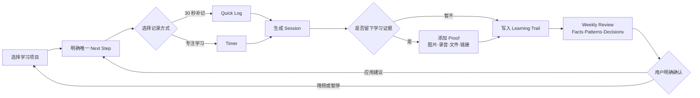
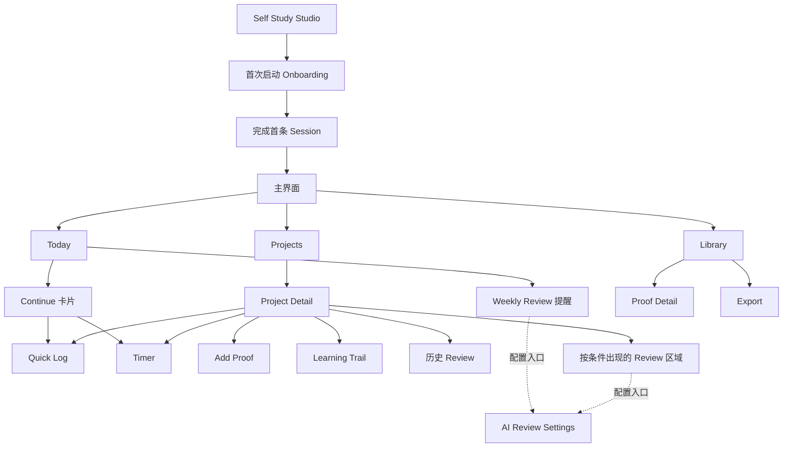
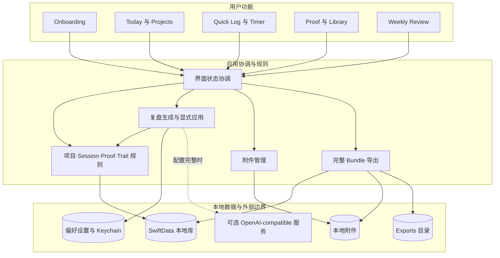
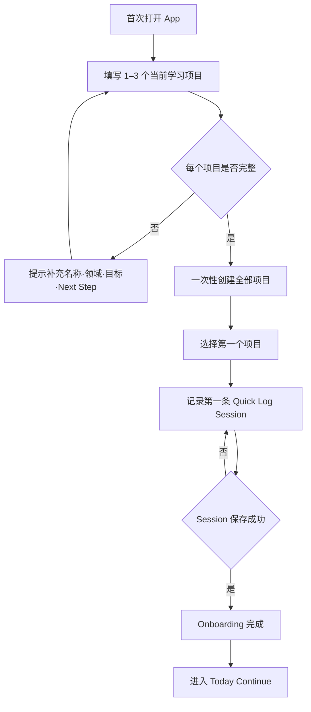
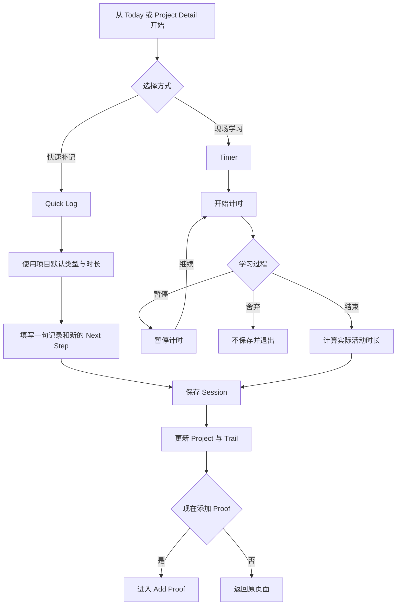
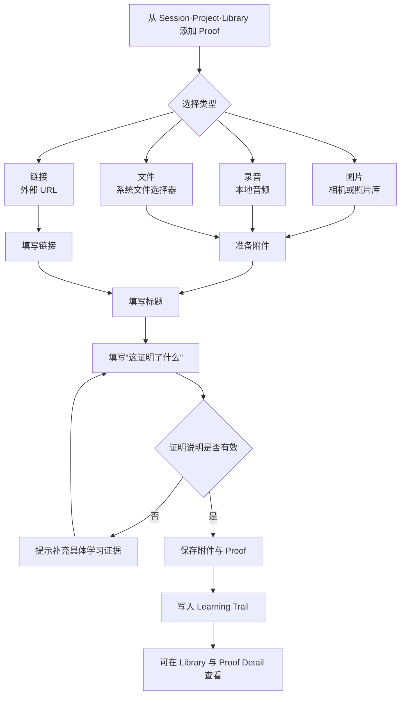
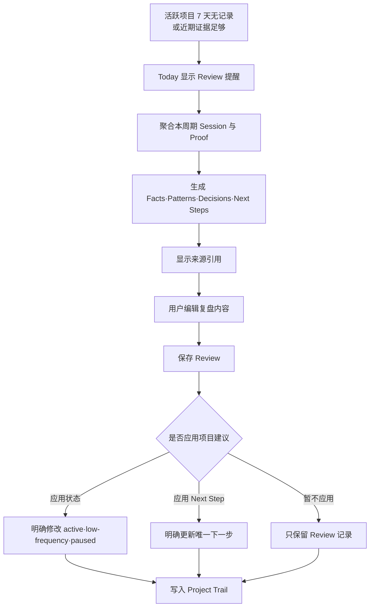
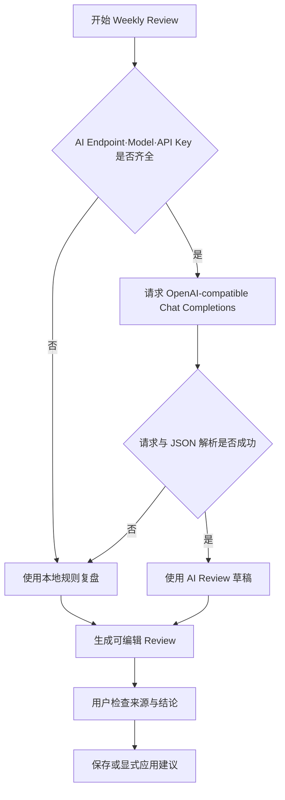
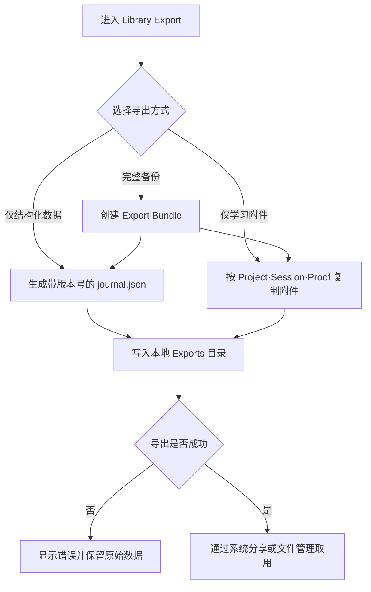

# Product Function Diagrams Implementation Plan

> **For agentic workers:** REQUIRED SUB-SKILL: Use superpowers:subagent-driven-development (recommended) or superpowers:executing-plans to implement this plan task-by-task. Steps use checkbox (`- [ ]`) syntax for tracking.

**Goal:** Create a maintainable visual suite that explains Self Study Studio's current product structure, core learning loop, detailed user flows, failure paths, and standard demo sequence.

**Architecture:** Mermaid `.mmd` files are the editable sources of truth. Each source is rendered to SVG for Markdown and PNG for presentation compatibility; `diagrams/PRODUCT_FUNCTION_DIAGRAMS.md` provides the ordered visual index and explicitly separates implemented behavior from designed-only capabilities.

**Tech Stack:** Mermaid flowcharts, Mermaid CLI through bundled `pnpm`, SVG, PNG, Markdown, shell validation.

## Global Constraints

- Describe only behavior verified in the current SwiftUI source and tests.
- Mark CloudKit/iCloud sync, AI course planning, and Calendar as designed-only; never place them inside current product flows.
- Use the stable terms Project, Next Step, Session, Proof, Trail, Review, Quick Log, and Timer.
- Use Chinese product copy and keep internal Swift type names out of user-facing diagrams.
- Never overwrite the user's untracked `app-feature-modules.*` or `app-user-journey*.{mmd,svg,png,excalidraw}` files.
- Every new diagram has one `.mmd` source, one `.svg`, and one `.png` with the same basename.
- Use neutral structure plus semantic labels; color may reinforce meaning but cannot be the only encoding.
- Keep each detailed flow focused on one user goal and fewer than 16 visible nodes.

---

## File Structure

- Create `diagrams/product-learning-loop.mmd`: core Project-to-Review product loop.
- Create `diagrams/product-information-architecture.mmd`: current screen and navigation map.
- Create `diagrams/product-functional-modules.mmd`: current UI, application rules, local storage, and optional AI boundary.
- Create `diagrams/product-demo-storyboard.mmd`: 5–10 minute demo sequence.
- Create `diagrams/product-onboarding-flow.mmd`: first-use project and first Session gate.
- Create `diagrams/product-session-flow.mmd`: Continue, Quick Log, Timer, Session, and Next Step flow.
- Create `diagrams/product-proof-flow.mmd`: Proof type, required statement, storage, and browsing flow.
- Create `diagrams/product-review-flow.mmd`: prompt, generation, edit, and explicit-apply flow.
- Create `diagrams/product-ai-fallback-flow.mmd`: AI configuration and local fallback decisions.
- Create `diagrams/product-export-flow.mmd`: JSON, attachments, and complete bundle flow.
- Create matching `.svg` and `.png` exports beside every source.
- Create `diagrams/PRODUCT_FUNCTION_DIAGRAMS.md`: visual index, captions, scope notes, and maintenance rule.
- Create `scripts/render-product-diagrams.sh`: deterministic rendering and export validation.

---

### Task 1: Core Product Overview Diagrams

**Files:**
- Create: `diagrams/product-learning-loop.mmd`
- Create: `diagrams/product-information-architecture.mmd`
- Create: `diagrams/product-functional-modules.mmd`
- Create: `diagrams/product-demo-storyboard.mmd`

**Interfaces:**
- Consumes: Current navigation and the domain chain `Project -> Session -> Proof -> Review`.
- Produces: Four overview sources used by the visual index and final product guide.

- [ ] **Step 1: Create the learning-loop source**

Write `diagrams/product-learning-loop.mmd` with this exact structure:



- [ ] **Step 2: Create the information-architecture source**

Write `diagrams/product-information-architecture.mmd` with three primary tabs and Settings reachable only from conditional Review areas:



- [ ] **Step 3: Create the functional-module source**

Write `diagrams/product-functional-modules.mmd` with three explicit layers:



- [ ] **Step 4: Create the demo-storyboard source**

Write `diagrams/product-demo-storyboard.mmd` as a seven-step horizontal story:


- [ ] **Step 5: Validate overview scope and terminology**

Run:

```bash
rg -n "CloudKit|Calendar|Course Plan|成员|排行榜" diagrams/product-learning-loop.mmd diagrams/product-information-architecture.mmd diagrams/product-functional-modules.mmd diagrams/product-demo-storyboard.mmd
rg -n "Project|Next Step|Session|Proof|Review" diagrams/product-learning-loop.mmd diagrams/product-information-architecture.mmd diagrams/product-functional-modules.mmd diagrams/product-demo-storyboard.mmd
```

Expected: the first command returns no matches; the second finds all five stable concepts across the overview set.

- [ ] **Step 6: Commit the overview sources**

```bash
git add diagrams/product-learning-loop.mmd diagrams/product-information-architecture.mmd diagrams/product-functional-modules.mmd diagrams/product-demo-storyboard.mmd
git commit -m "docs: add product overview diagram sources"
```

---

### Task 2: First-Use, Session, and Proof Flow Diagrams

**Files:**
- Create: `diagrams/product-onboarding-flow.mmd`
- Create: `diagrams/product-session-flow.mmd`
- Create: `diagrams/product-proof-flow.mmd`

**Interfaces:**
- Consumes: `OnboardingView`, `QuickLogView`, `TimerSessionView`, `AddProofView`, and the implemented validation rules.
- Produces: Three focused flow sources explaining daily product use.

- [ ] **Step 1: Create the onboarding flow**



- [ ] **Step 2: Create the Session flow**



- [ ] **Step 3: Create the Proof flow**



- [ ] **Step 4: Save the three sources and validate node limits**

Run:

```bash
for file in diagrams/product-onboarding-flow.mmd diagrams/product-session-flow.mmd diagrams/product-proof-flow.mmd; do rg -o "[A-Z][A-Z0-9]*\[|[A-Z][A-Z0-9]*\{" "$file" | wc -l; done
```

Expected: onboarding and Proof have no more than 16 nodes; Session may use up to 17 because pause/resume/discard are independently meaningful user states.

- [ ] **Step 5: Commit the daily-use sources**

```bash
git add diagrams/product-onboarding-flow.mmd diagrams/product-session-flow.mmd diagrams/product-proof-flow.mmd
git commit -m "docs: add onboarding session and proof flows"
```

---

### Task 3: Review, AI Fallback, and Export Flow Diagrams

**Files:**
- Create: `diagrams/product-review-flow.mmd`
- Create: `diagrams/product-ai-fallback-flow.mmd`
- Create: `diagrams/product-export-flow.mmd`

**Interfaces:**
- Consumes: current Review prompt rules, provider fallback behavior, explicit apply actions, and `ExportService` output types.
- Produces: Three decision-oriented flow sources used in product explanation and Demo backup paths.

- [ ] **Step 1: Create the Weekly Review flow**



- [ ] **Step 2: Create the AI fallback flow**



- [ ] **Step 3: Create the export flow**



- [ ] **Step 4: Validate explicit user control and fallback coverage**

Run:

```bash
rg -n "用户|明确|暂不应用" diagrams/product-review-flow.mmd
rg -n "本地规则复盘|请求与 JSON 解析是否成功" diagrams/product-ai-fallback-flow.mmd
rg -n "journal.json|附件|完整备份|错误" diagrams/product-export-flow.mmd
```

Expected: every command finds all listed terms.

- [ ] **Step 5: Commit the decision flows**

```bash
git add diagrams/product-review-flow.mmd diagrams/product-ai-fallback-flow.mmd diagrams/product-export-flow.mmd
git commit -m "docs: add review fallback and export flows"
```

---

### Task 4: Rendering Pipeline and Static Image Exports

**Files:**
- Create: `scripts/render-product-diagrams.sh`
- Create: `diagrams/product-*.svg`
- Create: `diagrams/product-*.png`

**Interfaces:**
- Consumes: all ten `diagrams/product-*.mmd` sources.
- Produces: reproducible SVG and PNG images suitable for Markdown and presentations.

- [ ] **Step 1: Create the rendering script**

Write a POSIX-compatible script that resolves repo root, accepts `PNPM_BIN`, and renders every `product-*.mmd`:

```bash
#!/bin/sh
set -eu

ROOT="$(cd "$(dirname "$0")/.." && pwd)"
PNPM_BIN="${PNPM_BIN:-pnpm}"
MERMAID_CLI_PACKAGE="${MERMAID_CLI_PACKAGE:-@mermaid-js/mermaid-cli@11.16.0}"

if [ -z "${PUPPETEER_EXECUTABLE_PATH:-}" ] && \
  [ -x "/Applications/Google Chrome.app/Contents/MacOS/Google Chrome" ]; then
  export PUPPETEER_EXECUTABLE_PATH="/Applications/Google Chrome.app/Contents/MacOS/Google Chrome"
fi

render_format() {
  format="$1"
  for source in "$ROOT"/diagrams/product-*.mmd; do
    base="${source%.mmd}"
    "$PNPM_BIN" dlx "$MERMAID_CLI_PACKAGE" \
      --input "$source" \
      --output "${base}.${format}" \
      --theme neutral \
      --backgroundColor white \
      --width 1800
  done
}

render_format svg &
svg_pid=$!
render_format png &
png_pid=$!
wait "$svg_pid"
wait "$png_pid"
```

- [ ] **Step 2: Make the script executable and run it**

Run:

```bash
chmod +x scripts/render-product-diagrams.sh
PNPM_BIN=/Users/bytedance/.cache/codex-runtimes/codex-primary-runtime/dependencies/bin/fallback/pnpm scripts/render-product-diagrams.sh
```

Expected: ten SVG files and ten PNG files are created without Mermaid parse errors.

- [ ] **Step 3: Validate file count and image integrity**

Run:

```bash
find diagrams -maxdepth 1 -name 'product-*.mmd' | wc -l
find diagrams -maxdepth 1 -name 'product-*.svg' | wc -l
find diagrams -maxdepth 1 -name 'product-*.png' | wc -l
file diagrams/product-*.svg diagrams/product-*.png
```

Expected: each count is `10`; `file` identifies every export as SVG or PNG image data.

- [ ] **Step 4: Visually inspect every PNG**

Open each PNG with the local image viewer and verify:

- no clipped node labels;
- no overlapping edges and labels;
- Chinese glyphs render correctly;
- the longest flow remains readable at full width;
- opaque white backgrounds preserve connector and label contrast;
- current and fallback paths are visually distinguishable by labels and shapes.

If a diagram fails, edit only its `.mmd` source, rerun the rendering script, and inspect again.

- [ ] **Step 5: Commit the pipeline and exports**

```bash
git add scripts/render-product-diagrams.sh diagrams/product-*.svg diagrams/product-*.png
git commit -m "docs: render product function diagrams"
```

---

### Task 5: Visual Index and Documentation Integration

**Files:**
- Create: `diagrams/PRODUCT_FUNCTION_DIAGRAMS.md`
- Modify: `README.md`

**Interfaces:**
- Consumes: all sources and rendered assets from Tasks 1–4.
- Produces: one discoverable visual guide and a repository entry point.

- [ ] **Step 1: Create the visual index**

Write `diagrams/PRODUCT_FUNCTION_DIAGRAMS.md` in this order:

1. Product learning loop
2. Current information architecture
3. Functional module relationships
4. Standard Demo storyboard
5. First-use onboarding
6. Daily Session recording
7. Proof creation
8. Weekly Review
9. AI fallback
10. Export

For each section embed the SVG with relative Markdown such as:

```markdown


图注：Quick Log 与 Timer 都生成同一种 Session；Review 只有在用户确认后才修改项目状态或 Next Step。
```

Add a final “尚未进入当前产品流程” section listing CloudKit/iCloud sync, AI course planning, and Calendar as designed-only.

- [ ] **Step 2: Add the README entry**

Immediately after the README introduction, add:

```markdown
## Product Documentation

- [产品功能说明图](diagrams/PRODUCT_FUNCTION_DIAGRAMS.md)
- [产品功能手册设计](docs/superpowers/specs/2026-07-12-product-guide-design.md)

When user-visible behavior changes, update the affected diagram source and regenerate its SVG and PNG exports.
```

- [ ] **Step 3: Validate links and maintenance metadata**

Run:

```bash
rg -n "product-.*\.svg" diagrams/PRODUCT_FUNCTION_DIAGRAMS.md
rg -n "产品功能说明图|user-visible behavior" README.md
git diff --check
```

Expected: the index contains ten SVG links, README contains both required maintenance lines, and `git diff --check` prints no errors.

- [ ] **Step 4: Re-run the current test baseline without changing product code**

Run:

```bash
swift test
```

Expected: 50 tests execute; the known `testOpenAICompatibleProviderParsesJSONContentFromChatCompletion` source-reference assertion may remain the single failure. Any additional failure blocks completion.

- [ ] **Step 5: Commit the visual index and README entry**

```bash
git add diagrams/PRODUCT_FUNCTION_DIAGRAMS.md README.md
git commit -m "docs: publish product function diagram guide"
```

---

## Final Verification

Run:

```bash
git status --short
find diagrams -maxdepth 1 -name 'product-*' | sort
rg -n "CloudKit|iCloud|Calendar|Course Plan" diagrams/product-*.mmd diagrams/PRODUCT_FUNCTION_DIAGRAMS.md
```

Expected:

- Only the user's pre-existing `.gitignore` and untracked legacy diagram files remain outside this plan's commits.
- Ten `.mmd`, ten `.svg`, and ten `.png` product diagram files exist.
- Designed-only features appear only in the visual index scope note, not inside current product flows.
- Every PNG has passed visual inspection.
